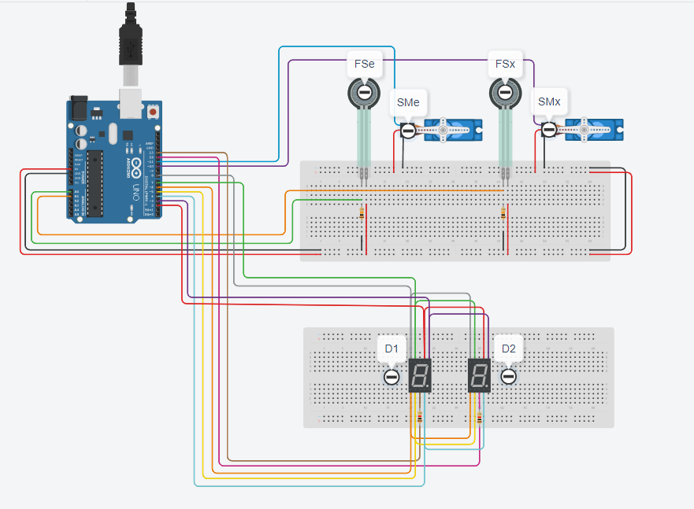

# Parking-Lot-Management-Simulation-Using-Arduino
A simulation of a parking management system using Arduino

# Schematics

# Required Components
This simulaiton will be using: 
-Survo X 2 
-Force Sensor X 2 
-7-Segment Display X 2

# Explanation of Code
There will be a total of 20 parking spots which will be counted using a variable called Cntr which will be displayed on the 7-Segment Display. 
When a vehicle is loaded on the force sensor, it will check for its weight in Newton where only vehicle between 2N to 5N is allowed to enter
the parking lot. When a vehicle is within the recommended weight class, the survo will turn 90 degrees to open the gates and have a delay of 15
seconds to allow the vehicle to enter the parking lot which the counter will decrease by 1 which will be reflected in the 7-Segment displays and
vice-versa at the exit. When the counter hits 0, the 7-Segment display will turn off and the survo will be disabled until a vehicle has exited the
parking lot. 
